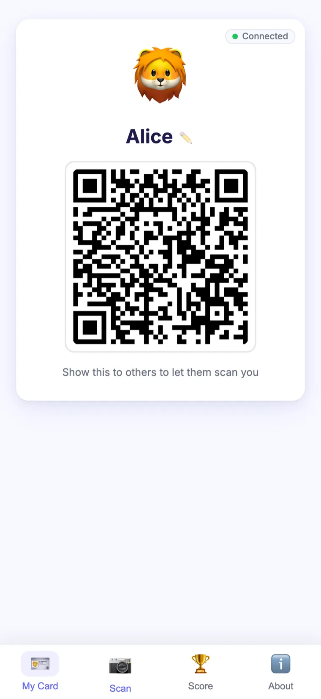
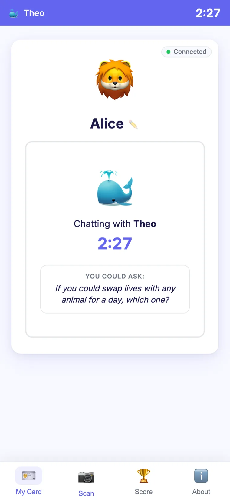
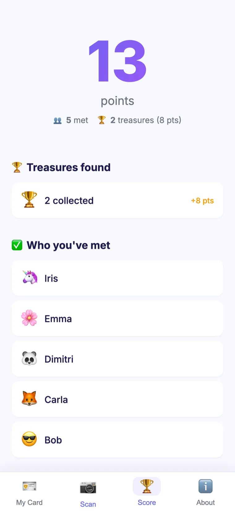
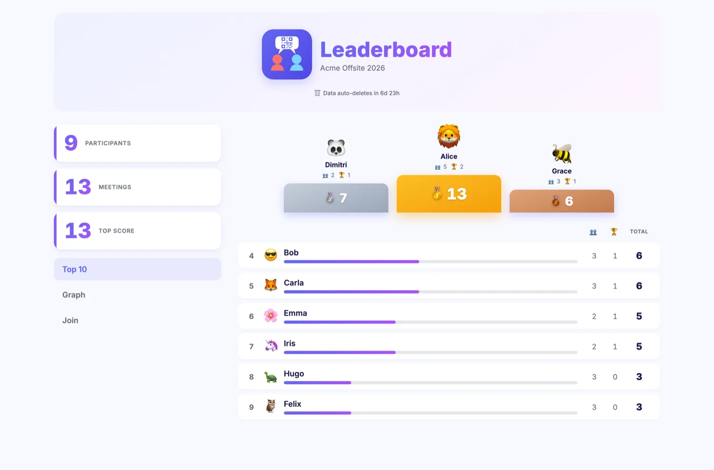

<div align="center">


# QRMeet

**Scan people, have conversations, earn points.**

A mobile-first networking game for in-person events — no install, no account, no sign-up.

📖 **[Usage guide](docs/usage.md)** · [Architecture](docs/architecture.md) · [API reference](docs/api.md)

</div>

Participants scan each other's QR codes to trigger a conversation timer, then scan again to confirm the meeting and earn a point. An optional treasure hunt awards bonus points from QR codes placed around the venue.

<p align="center">
  
  
  
</p>

<p align="center">
  
</p>

> 📖 New here? The **[Usage guide](docs/usage.md)** is an illustrated walkthrough with screenshots — for both participants and organisers.

## Technologies

Graphical user interface:

- web app using Alpine, no installation needed
- native technologies without transpiler, JavaScript / HTML / CSS

Backend server:
- use Cloudflare Workers and Durable Objects, with HTTP API and web sockets
- TypeScript

## How it works

1. An organiser creates a room and shares the room code with attendees.
2. Each participant opens the app on their phone and joins the room. No installation, no account or registration needed — the app assigns a private identity stored in `localStorage`.
3. Each participant gets a personal ID card showing their name, emoji, and a QR code.
4. When two people meet, one scans the other's QR code. A conversation countdown (5 minutes by default, configurable per room) starts on both phones.
5. After the timer elapses, scanning again confirms the meeting. Both participants earn +1 point.
6. A scoreboard shows each participant their own total and the list of people they've met.
7. The organiser can view a full leaderboard and an interactive encounter graph at `/r/{roomId}/board`.

**Treasure Hunt mode (on by default, can be disabled).** Each room lets the organiser print special QR codes to place around the venue. Anyone scanning one instantly earns points (default 3, configurable per code) — no conversation starts, and each person can collect a given treasure only once. These points add to the same leaderboard. Codes can be added, enabled/disabled, deleted, and re-printed from the admin dashboard's Treasure tab.

### Security model

- Every user has a `publicId` (embedded in QR codes) and a `privateToken` (stored only in `localStorage`, never in QR codes). All mutating API calls require the `privateToken`.
- QR codes embed a single-use opaque token fetched from the server. The token is burned on first scan, preventing QR replay and photo attacks.
- A fresh QR token is automatically issued after each session starts, so the confirmation scan uses a different token than the initial scan.

## Local development

No Cloudflare account needed. Wrangler simulates D1 and Durable Objects locally.

```bash
npm install
npm run db:migrate   # apply schema to local D1
npm run dev          # wrangler dev on http://localhost:8787
```

> For faster session testing, set `ENCOUNTER_DURATION_SECONDS = "30"` in `wrangler.toml` and restart.

### Tests

```bash
npm test             # Vitest — Workers (unit + integration) + front-end component logic (no extra setup)
npm run test:e2e     # Playwright — front-end & WebSocket end-to-end
```

The Playwright suite (`test/e2e/`) drives real browser contexts against a live `wrangler dev`. Two one-time prerequisites:

- A local `wrangler.toml` (copy `wrangler.sample.toml`) — same requirement as `npm run dev`.
- The browser binary: `npx playwright install chromium` (the `@playwright/test` package itself comes with `npm install`).

`npm run test:e2e` then handles the rest itself: it applies the local D1 migrations (`pretest:e2e` hook) and starts `wrangler dev` on `:8787` automatically (reusing an already-running one if present).

## Deploy to Cloudflare

### 0. Create configuration file

First, copy `wrangler.sample.toml` to a local `wrangler.toml`.
It is declared in the `.gitignore` file, so this is local only.

### 1. Authenticate

```bash
npx wrangler login
```

### 2. Create the D1 database

```bash
npx wrangler d1 create qrmeet-db
```

Copy the `database_id` from the output and paste it into `wrangler.toml`:

```toml
[[d1_databases]]
binding = "DB"
database_name = "qrmeet-db"
database_id = "xxxxxxxx-xxxx-xxxx-xxxx-xxxxxxxxxxxx"  # ← paste here
```

### 3. Apply the database schema

```bash
npm run db:migrate -- --remote
```

### 4. Deploy

```bash
npm run deploy
```

The Durable Object (`DurableRoom`) is registered automatically via the `[[migrations]]` block in `wrangler.toml` — no extra step needed.

### Continuous deployment (Cloudflare Workers Builds)

`wrangler.toml` is gitignored, so it is never committed — that keeps your own
`database_id` and custom domain out of the (public) repository. To let
[Cloudflare Workers Builds](https://developers.cloudflare.com/workers/ci-cd/builds/)
deploy on every push, the config is generated at build time from
`wrangler.ci.toml` (committed, with `${DATABASE_ID}` / `${DEPLOY_DOMAIN}`
placeholders) by `scripts/gen-wrangler.mjs`.

In the Workers Builds settings of your Cloudflare project:

- **Build command:** `npm ci && npm run gen:wrangler`
- **Deploy command:** `npx wrangler deploy` (the default)
- **Build variables** (encrypted — these hold the values kept out of the repo):
  - `DATABASE_ID` — the D1 database id from `wrangler d1 create`
  - `DEPLOY_DOMAIN` — the custom domain the worker is routed to (e.g. `qrmeet.example.net`)

Any additional value you want to keep private can be turned into a
`${PLACEHOLDER}` in `wrangler.ci.toml` and supplied the same way. Real secrets
(API tokens, keys) must **never** go in `wrangler.ci.toml` — use
`npx wrangler secret put` or the dashboard instead.

## Scripts

| Command | Description |
|---|---|
| `npm run dev` | Local dev server (wrangler, port 8787) |
| `npm run deploy` | Deploy to Cloudflare |
| `npm run gen:wrangler` | Generate `wrangler.toml` from `wrangler.ci.toml` (used by CI; needs `DATABASE_ID` / `DEPLOY_DOMAIN` env vars) |
| `npm run db:migrate` | Apply D1 migrations locally |
| `npm run db:migrate -- --remote` | Apply D1 migrations on production |
| `npm test` | Run the Vitest suite — `workers` (unit + Workers integration) and `frontend` (Alpine component logic) projects |
| `npm run test:watch` | Run the test suite in watch mode |
| `npm run test:frontend` / `npm run test:workers` | Run a single Vitest project |
| `npm run test:e2e` | Run the Playwright end-to-end suite (front-end + WebSocket; auto-starts `wrangler dev`) |
| `npm run simulate -- --create-room` | Simulate users and encounters against a running instance (use `--room <id>` to target an existing room) |
| `npm run release -- <major\|minor\|patch>` | Cut a release from `main`: changelog section, version bump, commit, tag, push (see [docs/guidelines.md](docs/guidelines.md)) |

## Further reading

- [docs/usage.md](docs/usage.md) — illustrated usage guide for participants and organisers
- [docs/architecture.md](docs/architecture.md) — stack, data model, infrastructure, design decisions
- [docs/api.md](docs/api.md) — full API endpoint reference
- [docs/flows.md](docs/flows.md) — user flows, state machines, sequence diagrams
- [docs/guidelines.md](docs/guidelines.md) — development rules and conventions

## License

[MIT](LICENSE) — Copyright (c) 2026 Vincent Hiribarren
