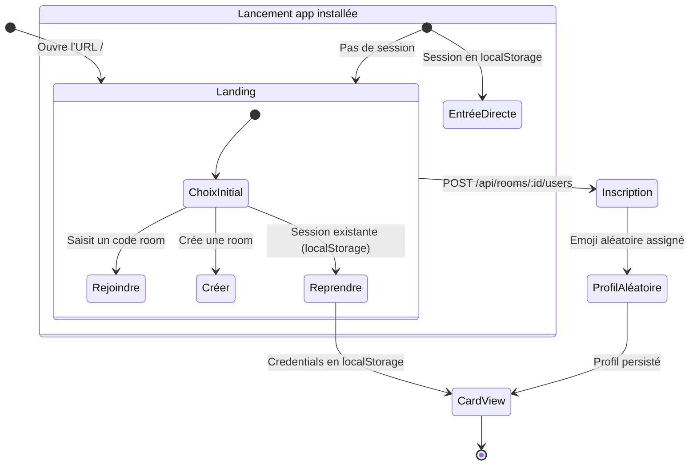
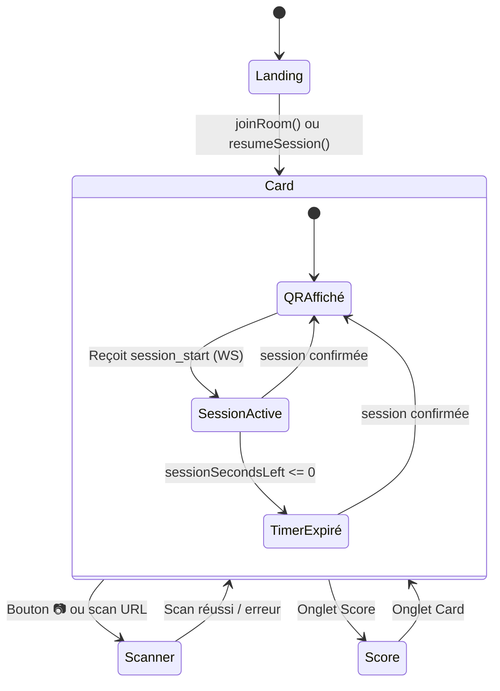
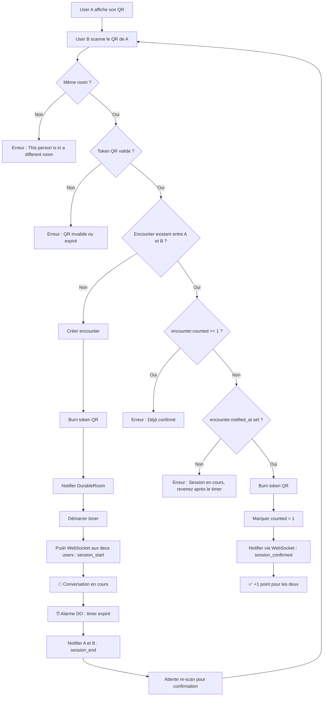
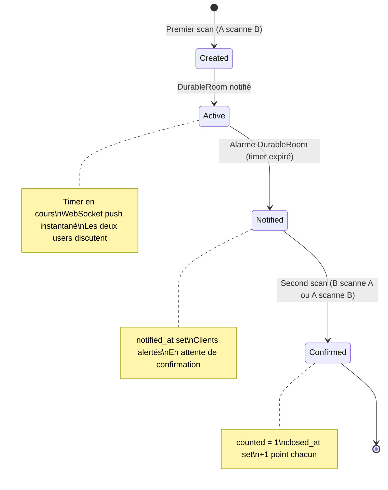
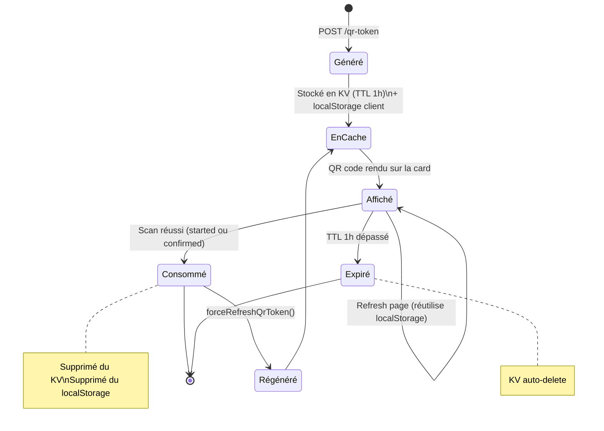
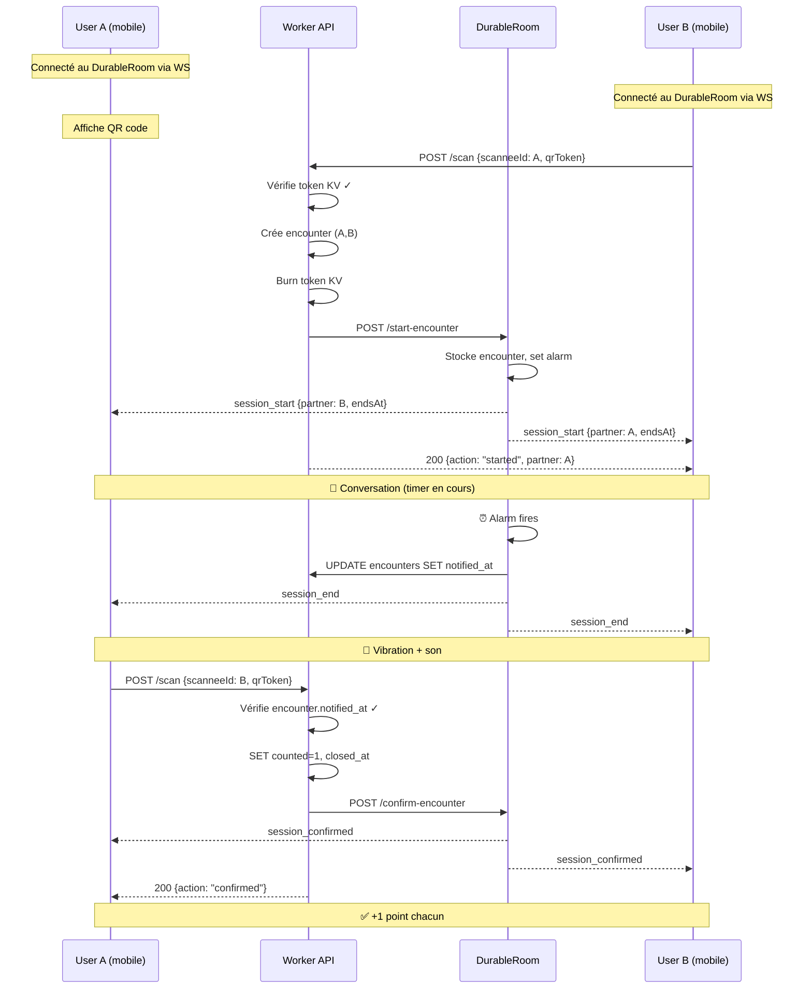

# Design — QRMeet

## Vue d'ensemble

QRMeet est un jeu de networking en événement. Les participants scannent les QR codes des autres pour initier des conversations minutées. Après le timer, ils se re-scannent pour confirmer la rencontre et gagner un point.

---

## Activation de l'app — Parcours utilisateur

---

## États de l'app côté client

---

## Système de rencontre — Diagramme d'activité

---

## Cycle de vie d'un Encounter

---

## Cycle de vie d'un QR Token

---

## Séquence complète d'une rencontre

---

## Résumé des états serveur

| État | `started_at` | `notified_at` | `closed_at` | `counted` | Signification |
|------|:---:|:---:|:---:|:---:|---|
| Active | ✓ | — | — | 0 | Timer en cours, conversation |
| Notified | ✓ | ✓ | — | 0 | Timer expiré, en attente de confirmation |
| Confirmed | ✓ | ✓ | ✓ | 1 | Rencontre validée, points attribués |
