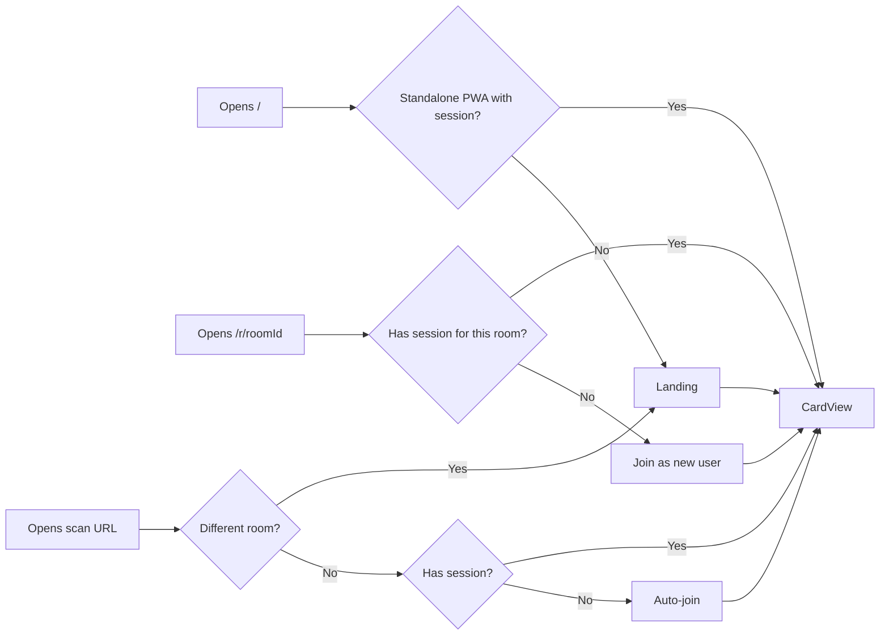
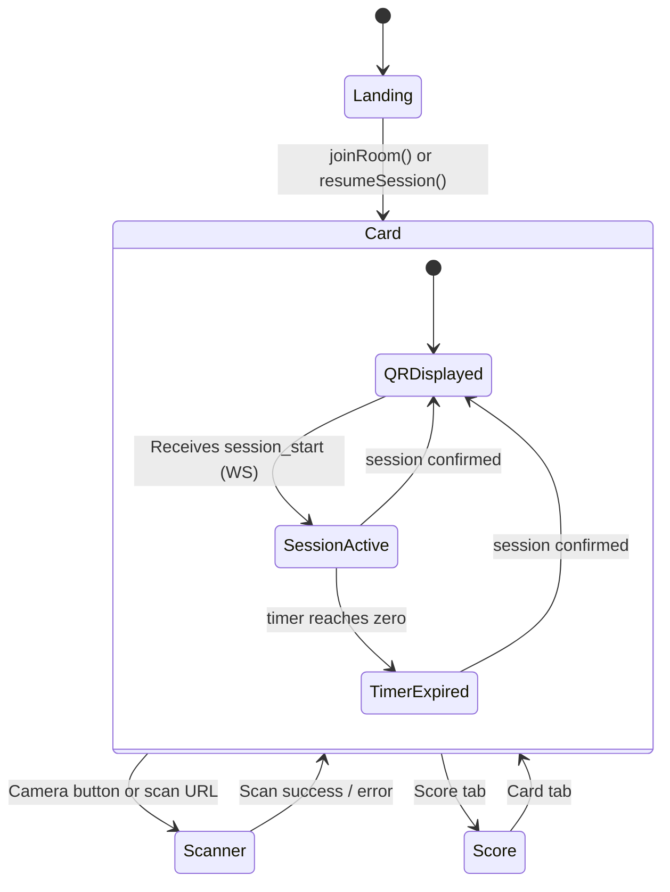
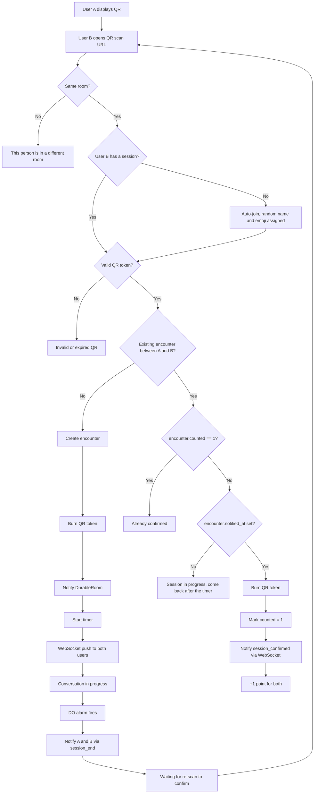
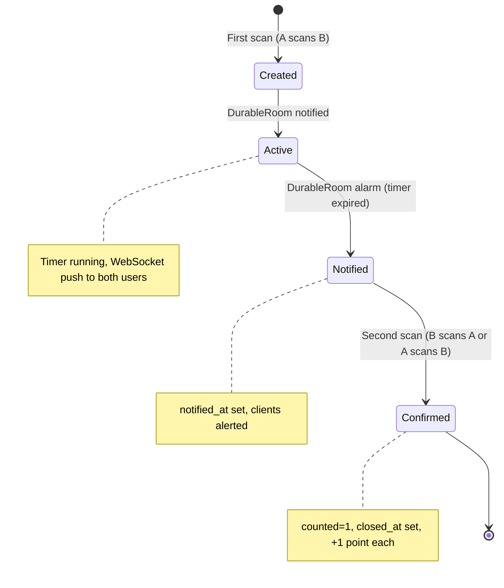
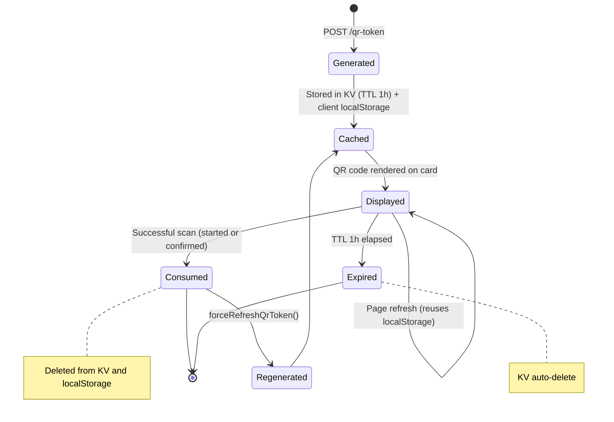
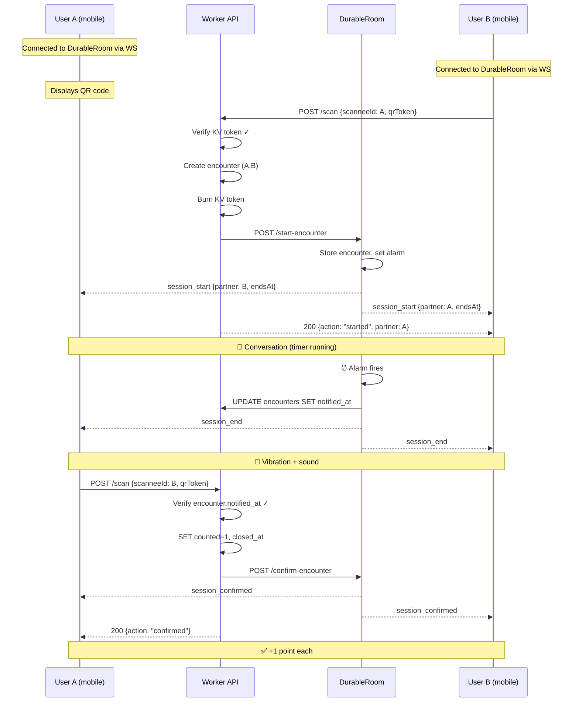

# Flows — QRMeet

## Overview

QRMeet is a networking game for in-person events. Participants scan each other's QR codes to start timed conversations. When the timer ends, they scan each other again to confirm the meeting and earn a point.

---

## App activation — User journey

---

## Client-side app states

---

## Encounter system — Activity diagram

---

## Encounter lifecycle

---

## QR token lifecycle

---

## Full encounter sequence

---

## Server state summary

| State | `started_at` | `notified_at` | `closed_at` | `counted` | Meaning |
|-------|:---:|:---:|:---:|:---:|---|
| Active | ✓ | — | — | 0 | Timer running, conversation |
| Notified | ✓ | ✓ | — | 0 | Timer expired, awaiting confirmation |
| Confirmed | ✓ | ✓ | ✓ | 1 | Meeting validated, points awarded |
