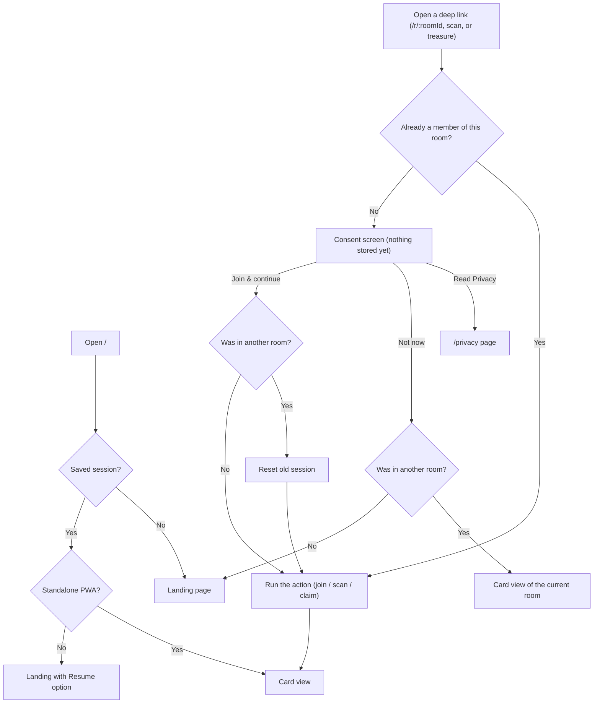
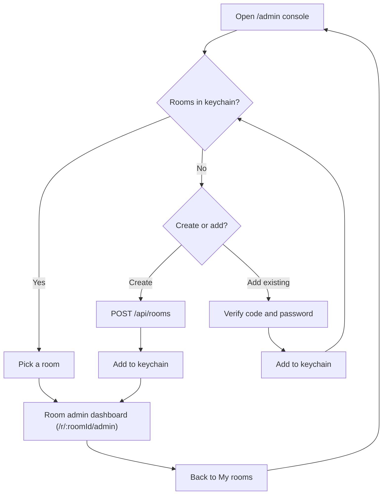
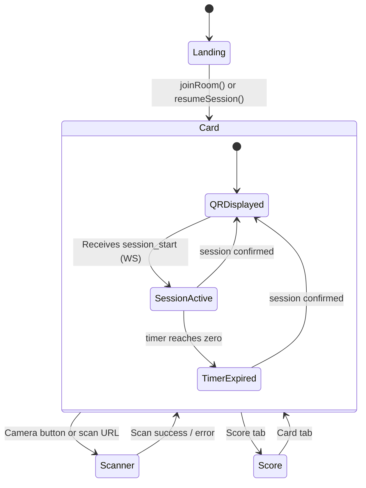
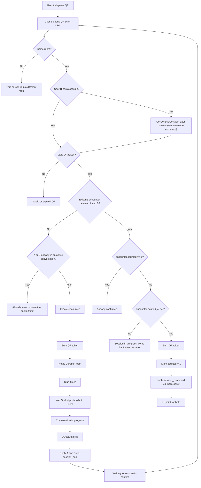
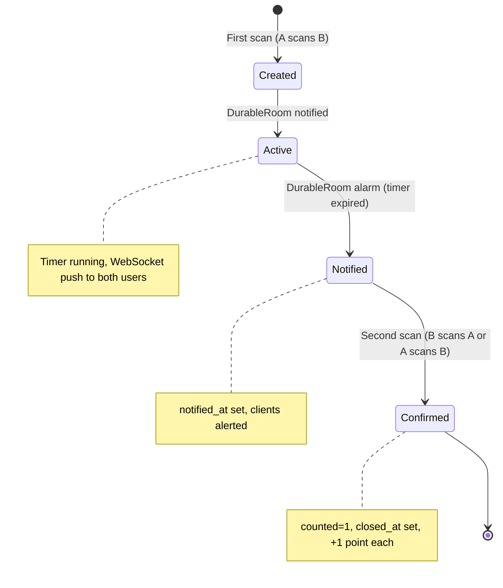
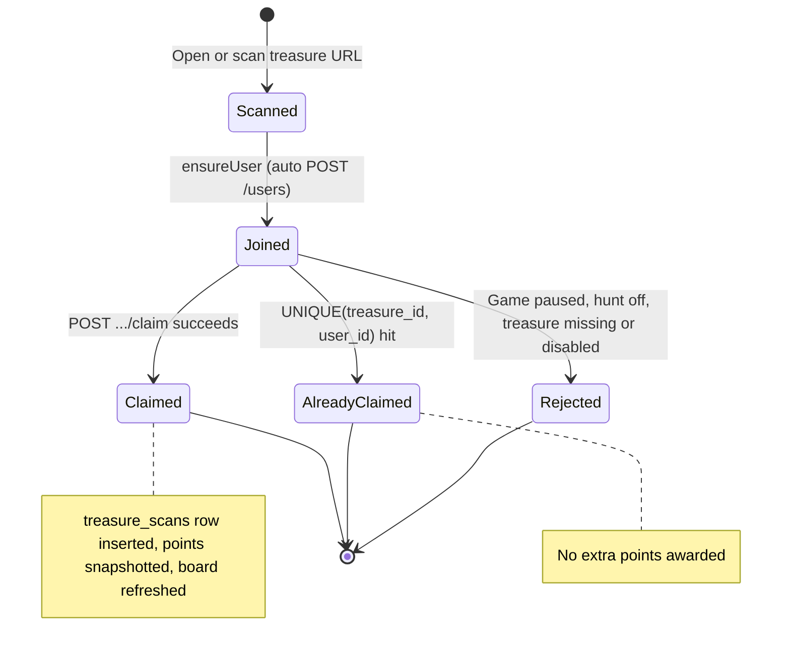
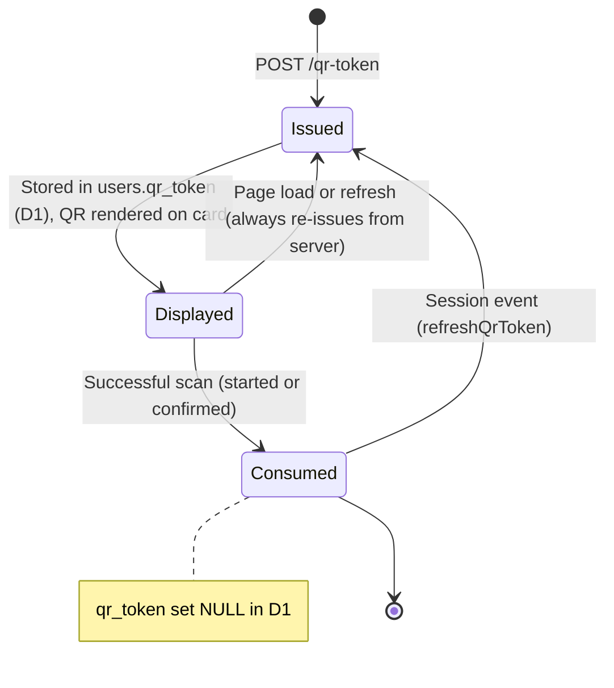
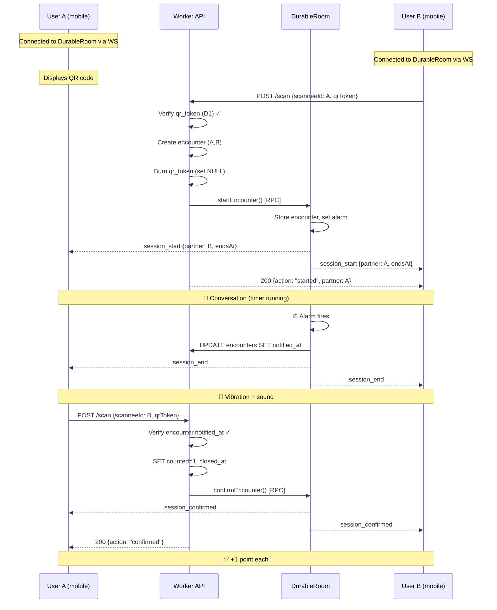

# Flows — QRMeet

## Overview

QRMeet is a networking game for in-person events. Participants scan each other's QR codes to start timed conversations. When the timer ends, they scan each other again to confirm the meeting and earn a point.

---

## App activation — User journey

All deep links (`/r/:roomId`, the scan URL, and the treasure URL
`/r/:roomId/treasure/:treasureId`) share the same **entry consent gate**: nothing
is created — server-side or in `localStorage` — until the visitor taps
"Join & continue". A visitor who already has a session for that room skips the
screen. The scan URL then processes the scan and the treasure URL claims the
treasure (see [Treasure claim](#treasure-claim)).

---

## Admin access — multi-room

The admin role is decoupled from the player session. A device keeps an **admin keychain** (`adminKeychain` in `storage.js`) listing every room it administers, independent of the single player session. So the same phone can play in one room *and* manage several rooms without either overwriting the other.

Entry points to the `/admin` console (the keychain launcher):
- **Hidden long-press (~3s) on the About logo** — the primary entry inside an installed PWA, which has no URL bar. Purely a UI affordance to keep it out of players' way; it is **not** a security control (the admin password is the only real gate).
- **PWA manifest shortcut** ("My rooms") — long-press the app icon.
- **Direct URL** `/admin` — for a regular browser.

The "Add an existing room" path is what makes a desktop-created room reachable from a phone: the organiser enters the room code and password, the console authenticates against `GET /api/admin/rooms/:id/scores`, and on success stores the hashed credential in the device keychain.

---

## Client-side app states

---

## Encounter system — Activity diagram

---

## Encounter lifecycle

---

## Treasure claim

Treasure hunt mode is independent of the encounter game. A treasure QR encodes a static URL `/r/:roomId/treasure/:treasureId`. Scanning it (or opening the link) auto-joins the visitor if needed and instantly awards points — **no conversation, timer, or confirmation scan**, and each player can claim a given treasure only once.

Contrast with the encounter flow above: a treasure claim is a single one-shot award (default 3 points, per-QR overridable) that bypasses the busy-guard, so it works even while a player is mid-conversation. Points feed the same unified leaderboard.

---

## QR token lifecycle

---

## Full encounter sequence

---

## Server state summary

| State | `started_at` | `notified_at` | `closed_at` | `counted` | Meaning |
|-------|:---:|:---:|:---:|:---:|---|
| Active | ✓ | — | — | 0 | Timer running, conversation |
| Notified | ✓ | ✓ | — | 0 | Timer expired, awaiting confirmation |
| Confirmed | ✓ | ✓ | ✓ | 1 | Meeting validated, points awarded |
