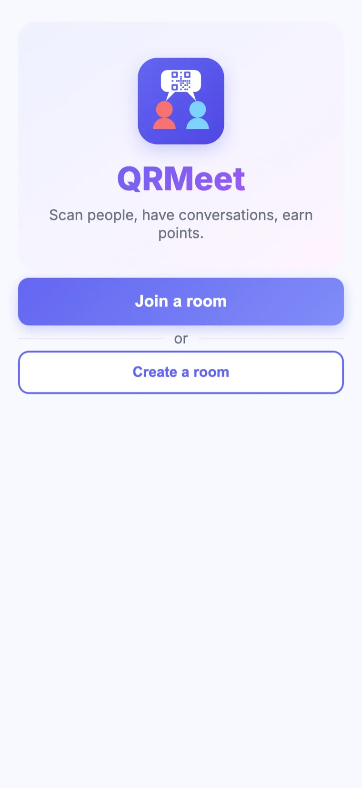
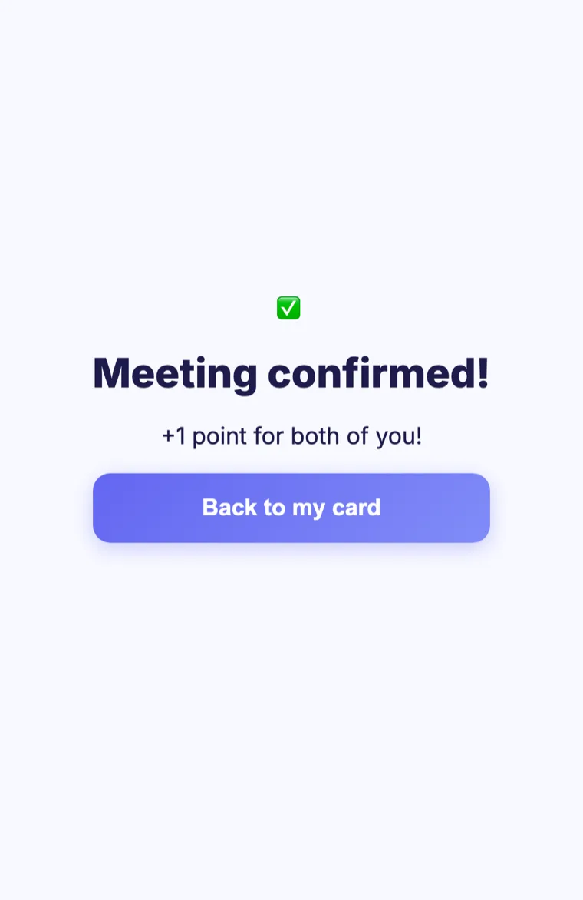
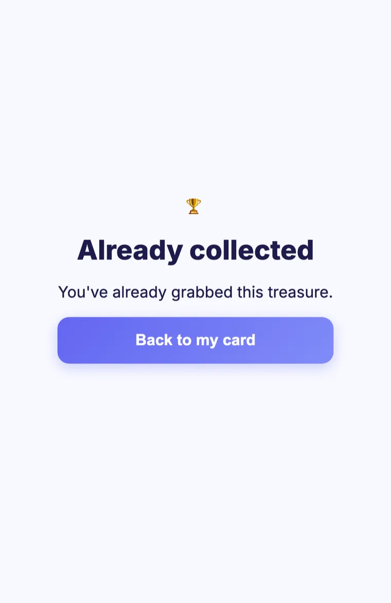
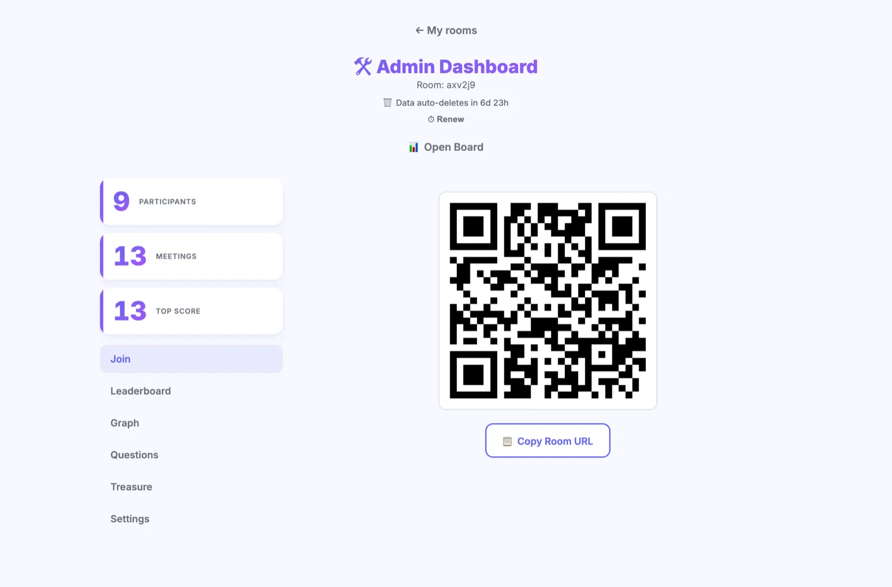
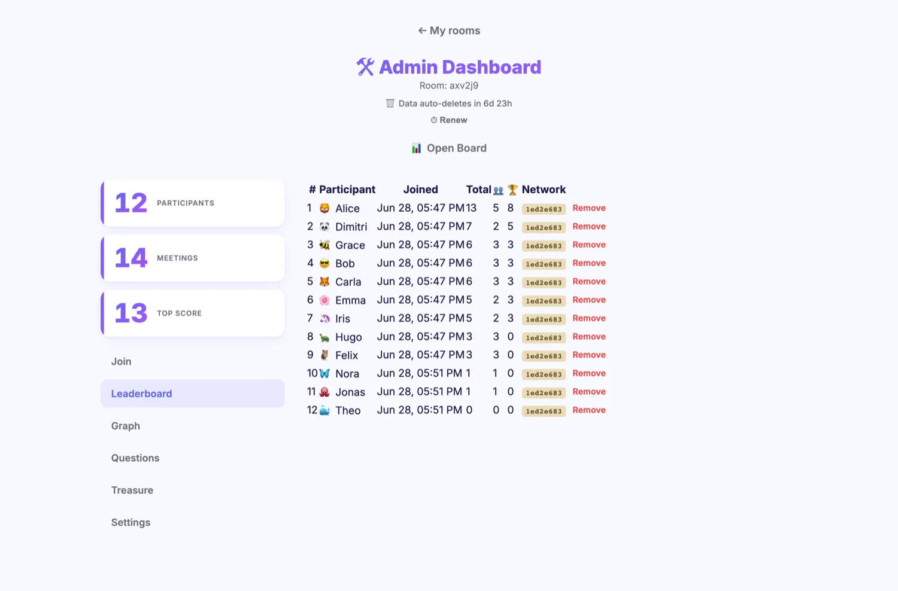
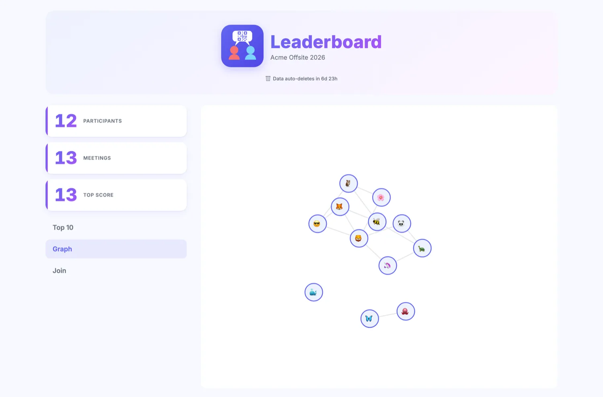

# Usage guide — QRMeet

QRMeet turns "go meet new people" into a game. Participants scan each other's QR
codes to start a short, timed conversation, then scan again to confirm the meeting
and earn a point. An optional treasure hunt lets people collect bonus points from
QR codes placed around the venue.

This guide is split in two:

- [For participants](#for-participants) — join, meet people, earn points.
- [For organisers](#for-organisers) — create and run a room.

Everything runs in the phone's browser. **No app install, no account, no sign-up.**

---

## For participants

### 1. Join a room

Open the room link (or scan the room's QR code, or type the room code on the
landing page) and tap **Join a room**. You are added instantly with a random name
and emoji — no registration.

> Your identity lives only in your browser's local storage. Tap your name or emoji
> on your card to personalise them.

### 2. Your ID card

Your card shows your name, emoji, and a personal QR code. This is what others scan
to meet you. The little dot at the top shows your live connection status.

> The QR code is single-use: it refreshes automatically after each scan, so a photo
> of your screen can't be reused.

### 3. Start a conversation

When you meet someone, **one of you scans the other's QR code** (tap **Scan** in the
bottom bar, or open their QR). A countdown starts on *both* phones with a suggested
ice-breaker question. Talk until the timer runs out.

> You can only have one conversation running at a time — finish the current one
> before starting another.

### 4. Confirm the meeting

When the timer ends, both phones buzz. **Scan each other again** to confirm the
meeting — you each earn **+1 point**.

### 5. Track your score

The **Score** tab shows your total points, how many people you've met, and any
treasure points. Tap a name to remember who you talked to.

### 6. Treasure hunt (if enabled)

The organiser may hide special **treasure** QR codes around the venue. Scanning one
instantly awards bonus points — no conversation needed. Each treasure can be
collected only once per person.

### Keep it handy (optional)

For quick access during the event:

- **Android / Chrome** — tap the **Install QRMeet** banner, or use the browser's
  "Add to Home screen" menu. Your session and score are preserved.
- **iPhone / Safari** — tap **Share**, then **Add Bookmark**, and keep the tab
  open. Do **not** use "Add to Home Screen" on iOS: the home-screen app has its
  own storage, separate from Safari's, so it would start you over with a new
  profile and an empty score.

---

## For organisers

### 1. Create a room

From the landing page, tap **Create a room**, give it a name, and set an admin
password. You're taken straight to the admin dashboard. The room (and all its data)
auto-deletes after a configurable lifetime — one week by default.

> The admin password is the only gate to the dashboard. Keep it safe; you can
> re-open the dashboard from any device with the room code and password.

### 2. Invite participants

The admin dashboard's **Join** tab shows the room's QR code and link. Display the
QR on a screen, print it on table tents, or share the link — anyone who scans or
opens it joins immediately.

### 3. Watch the leaderboard

The **Leaderboard** tab lists every participant with their score, join time, and a
per-room **network tag** (a privacy-preserving hash of their network) that helps
spot duplicate or bot accounts. You can remove a participant from here.

### 4. Project the public board

Open `/r/{roomId}/board` on a big screen — no password needed. It shows a live
podium and ranked leaderboard that updates as people meet.

The **Graph** view draws the live encounter network — every node is a participant,
every edge a confirmed meeting. It's a great visual of the room warming up. The
bigger a node, the more people that participant has met. Scroll to zoom, drag to
pan, and tap a node to focus it — the rest dims and the names of its direct
connections appear, so relationships stay readable even in a packed room.

### 5. Set up a treasure hunt

In the **Treasure** tab, create treasure codes (each with an optional point value),
then print them and place them around the venue. Codes can be enabled, disabled,
re-printed, or deleted at any time. Treasure points feed the same leaderboard.

### 6. Tune the room in Settings

The **Settings** tab lets you adjust the game live:

- **Pause / resume** scanning (freezes meetings *and* treasure claims).
- **Conversation duration** — how long each timed chat lasts.
- **Conversation questions** — toggle them and edit the ice-breaker pool (Questions tab).
- **Treasure hunt** — turn the mode on or off and set the default points.
- **Participant cap** and **board size**.
- **Renew** — reset the auto-deletion countdown for a longer event.

---

## Running a good event — tips

- **Show the join QR big.** A screen or printed poster at the entrance gets people
  in within seconds.
- **Keep conversations short.** 3–5 minutes keeps energy high and the room mixing.
- **Project the board.** A live leaderboard and the encounter graph drive friendly
  competition.
- **Sprinkle treasures** in out-of-the-way spots to get people exploring the venue.
- **Pause for announcements.** Use the pause toggle so nobody starts a chat during a
  speech, then resume.

See [flows.md](flows.md) for the underlying state machines and [api.md](api.md) for
the full API reference.
